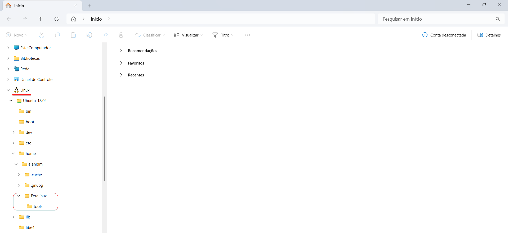
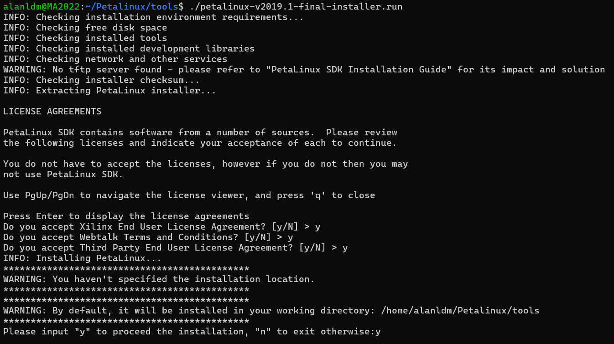
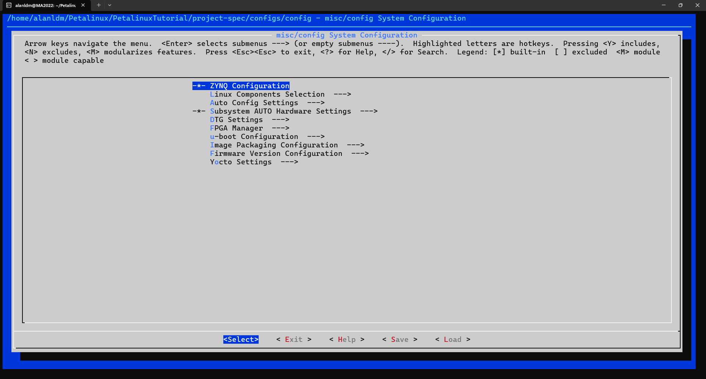
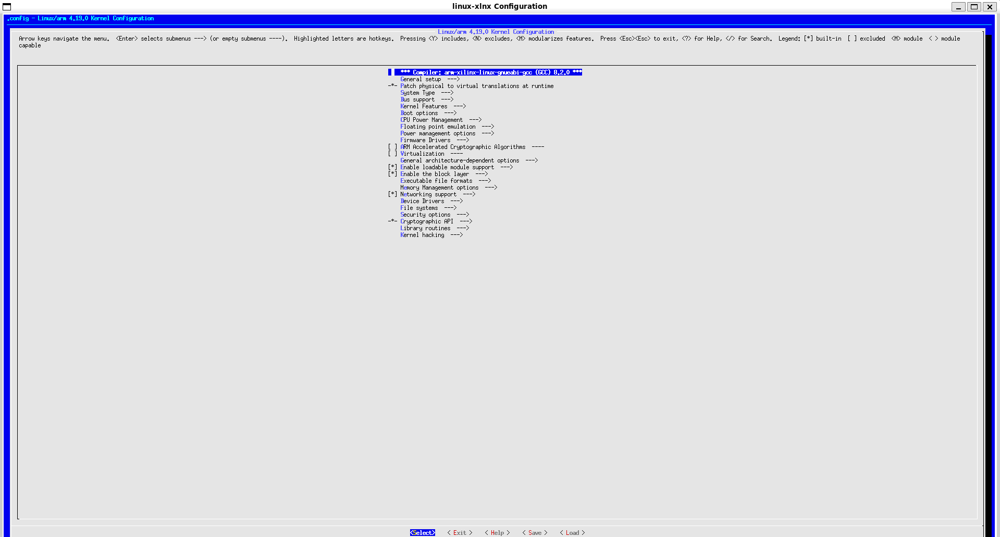
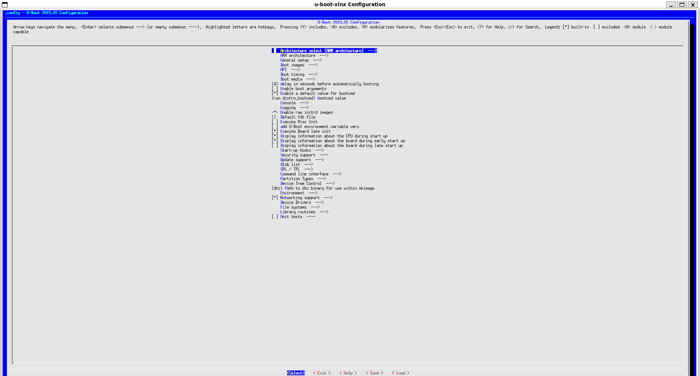
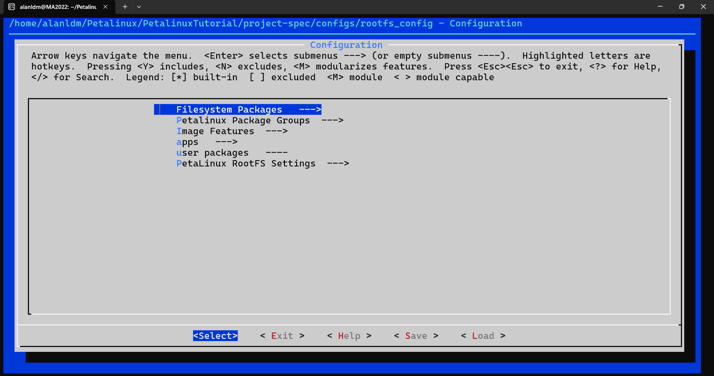

# 🧠 Customized Linux on FPGA/Zynq with WSL & Windows

> 🔰 To follow this tutorial, it's recommended that you complete at least one basic Zynq project tutorial beforehand.
>  
> For example, the official Avnet website offers a good starting point in the *Reference Designs* section:  
> 👉 ["Tutorial 01 – Build the Zynq Hardware Platform"](https://www.avnet.com/americas/products/avnet-boards/avnet-board-families/picozed/)

## 🐧 Windows Subsystem for Linux (WSL)
### ❓ What is Windows Subsystem for Linux (WSL)?

If you're tired of wasting time rebooting your computer just to switch operating systems, here’s a solution for your dual-boot headaches. **Windows Subsystem for Linux (WSL)** is a Windows feature that allows you to run Linux distributions — such as **Ubuntu**, **Fedora**, and **Debian** — directly on Windows

This is especially useful when you're working in Windows but need access to a Linux environment. For example, In this tutorial, I’ll show you how to customize a Linux system with the goal of embedding it into a **Zynq** platform.

### Setup used in this tutorial
For the sake of clarity, this tutorial was developed using the following hardware and software configuration:

#### Hardware
- **FMC Carrier V1**
- **SoM PicoZed 7015**
- **Zynq-7000 SoC**

#### Software
- **Vivado 2019.1**
- **Xilinx SDK 2019.1**
- **Windows 11**

### 💽 How to Install WSL on Your Machine

If you don’t have WSL installed yet, you can install it by opening **PowerShell as Administrator** and running the following command:

```Shell
wsl --install
```

Once WSL is installed, you’ll need to choose between WSL 1 and WSL 2.
- WSL 1 translates Linux system calls directly to the Windows kernel.
- WSL 2, on the other hand, runs a virtual machine, offering full compatibility with Linux tools and packages.

WSL 2 also provides better integration with the Windows file system, which makes it the recommended version for most development workflows — and the one we'll use in this tutorial.

To set WSL 2 as the default version, run:

```Shell
wsl --set-default-version 2
```

### 🐧 How to Install a Linux Distribution

Normally, after installing WSL, the latest version of **Ubuntu** is installed by default. However, if you'd like to use a different distribution, you can start by listing the available ones:

```Shell
wsl --list --online
```

Then you can either install a Linux distribution through the **Microsoft Store** or by running:

```Shell
wsl --install -d <Distribution Name>
```

Replace `<Distribution Name>` with the exact name of the distribution you want to install. For example, since I'm working with **Vivado 2019.1**, which has better compatibility with older Linux versions, I'll be using **Ubuntu-18.04**. So the command becomes:

```Shell
wsl --install -d Ubuntu-18.04
```


## ⚙️ Initial Setup

Now that we’ve finished the necessary installations, we need to prepare the Linux environment to create our own Linux system for the FPGA.

>💡 **Reminder:** If you don’t want to use WSL, you can follow the next steps on a native Linux machine as well!

The next step is to install **PetaLinux** in our Linux environment.

> **PetaLinux** is a tool developed by Xilinx that allows you to configure, build, and customize embedded Linux distributions — specifically for systems that use `Zynq`, `Zynq UltraScale+`, or `MicroBlaze`.

To install PetaLinux, you need to download the installer from the official [Xilinx website](https://www.xilinx.com/support/download/index.html/content/xilinx/en/downloadNav/embedded-design-tools/archive.html). An account will be required.

>⚠️ **Attention:** Make sure to download the correct file: look for `PetaLinux <Version> Installer` (e.g., `PetaLinux 2019.1 Installer`) in the list.

On Windows, search for the Linux distribution you installed (e.g., *Ubuntu-18.04*) and open it. Then, create a directory in a proper location to keep things organized:

```Bash
mkdir Petalinux
cd Petalinux
mkdir tools
```

You may notice that these folders appear in your *Windows File System* as well:



Next, copy the `PetaLinux <Version> Installer` file into the `Petalinux/tools/` directory. To make the installer executable, run the following command in your Linux terminal:

```Bash
chmod +x <File Name>.run
```

For example, in my case:

```Bash
chmod +x petalinux-v2019.1-final-installer.run
```

If you try to run the installer at this point, you’ll likely get an error. Why?
Well... PetaLinux requires several packages and dependencies to work properly.

But don’t worry — Xilinx has already done the hard work for us. They provide a script that installs all required packages for the build host.

You can find it on their official support site, in the following article: [73296 - PetaLinux: How to install the required packages for the PetaLinux Build Host?](https://adaptivesupport.amd.com/s/article/73296?language=en_US). From there, download the script file called `plnx-env-setup.sh`, and place it in the same directory, `Petalinux/tools/`.

Back in your Linux terminal, give execution permission to the script you have just downloaded and run it with superuser privileges:

```Bash
chmod +x plnx-env-setup.sh
sudo ./plnx-env-setup.sh
```

This script will install most of the required packages for PetaLinux.

Now, try running the PetaLinux installer. If you still encounter errors due to missing dependencies, you’ll need to install them manually. For example, in my case, even after running the `plnx-env-setup.sh` script, I had to manually install the `zlib1g:i386` package:

```Bash
sudo dpkg --add-architecture i386
sudo apt update
sudo apt upgrade
sudo apt install zlib1g:i386
```

>🛠️ Tip: If additional packages are missing, read the error messages carefully — they often tell you exactly what is needed. You can then install those packages using apt install.

Finally, with all the required packages installed, you can run the PetaLinux installer. Accept the license agreements and choose an installation directory - you can safely use `Petalinux/tools`.



After the installation, you may have noticed that a lot of files and folders were created. The most important one is `settings.sh`, which sets up the environment to use PetaLinux commands.

To enable these commands, run:
```Bash
source ./settings.sh
```

>ℹ️ You’ll need to run this command every time you reopen your Linux distribution (e.g., a new terminal session).

If you see the following warning:
> *"WARNING: /bin/sh is not bash! 
bash is PetaLinux recommended shell. Please set your default shell to bash"*

It means that your system is using `dash` as the default shell for `/bin/sh`, which can cause issues during PetaLinux operations.

To check and fix this, run:

```Bash
ls -l /bin/sh   #Output: /bin/sh -> dash
sudo dpkg-reconfigure dash
```

In the popup dialog, select “No” when asked if you want to use `dash` as the default `/bin/sh`.

>⚠️ **Attention:** Changing the default shell from `dash` to `bash` may affect other system scripts. It is recommended to do this only in isolated environments like `WSL`, `containers`, or `virtual machines`.

After changing the shell, run the setup script again: `source ./settings.sh`.

## 🛠️ Creating the PetaLinux Project

Everything is now set up to begin building our customized Linux system! Navigate to the directory where you want to create your PetaLinux project and run:

```Bash
petalinux-create -t project -n <Project Name> --template <Hardware Model>
```

>💡 **Tip:** You can run any PetaLinux command with `--help` to better understand its usage.
Example: petalinux-create --help

For example:

```Bash
petalinux-create -t project -n PetalinuxTutorial --template zynq
```

Expected output:

```Bash
:'Output:
INFO: Create project: PetalinuxTutorial
INFO: New project successfully created in /home/alanldm/Petalinux/PetalinuxTutorial'
```

### 📥 Importing Your Hardware Description (HDF/XSA)

Enter the newly created project folder and then load you hardware description file. You can export this file from Vivado after generating the bitstream via: `File > Export > Export Hardware`.

>✅ Make sure to include the bitstream when exporting the hardware file!

Depending on your Vivado version, the exported file will be either `.xsa` (Vivado 2020.1+) or `.hdf` (older versions). Copy this file to the root of your project directory, `Petalinux/PetalinuxTutorial/`, and then run the following command to configure your project with the hardware description:

```Bash
petalinux-config --get-hw-description=./
```

This will open a graphical configuration interface, where you can review and modify hardware settings such as:
- Enabled interfaces (UART, Ethernet, etc.)
- Available memory
- Boot options
- Kernel configurations



Navigate through the menu and select the option `Image Packaging Configuration`. Inside it, look for `Copy final images to tftpboot` option and disabled it by pressing `n`.

> This prevents PetaLinux from automatically copying the generated images to `/tftpboot`, which is usually used in network boot setups. Disabling this option is especially useful if you're not using `TFTP` or if you're working in WSL or a VM where `/tftpboot` may not exist. 

Press "Exit" and confirm "Save" when prompted. You should see output similar to:

```Bash
:'INFO: Getting hardware description...
INFO: Rename Zynq_wrapper.hdf to system.hdf
[INFO] generating Kconfig for project
[INFO] menuconfig project
configuration written to /home/alanldm/Petalinux/PetalinuxTutorial/project-spec/configs/config

*** End of the configuration.
*** Execute 'make' to start the build or try 'make help'.

[INFO] sourcing bitbake
[INFO] generating plnxtool conf
[INFO] generating meta-plnx-generated layer
[INFO] generating user layers
[INFO] generating machine configuration
[INFO] generating bbappends for project . This may take time !
[INFO] generating u-boot configuration files
[INFO] generating kernel configuration files
[INFO] generating kconfig for Rootfs
[INFO] silentconfig rootfs
[INFO] generating petalinux-user-image.bb'
```

## 🧵 Kernel Configuration

Since the project has been created and the hardware description has been imported, we can now configure the **Linux kernel**. To begin, run:

```Bash
petalinux-config -c kernel
```

After a few moments, another configuration interface will appear:



For this tutorial, we won't make any changes — but here you have access to a wide range of kernel customization options, such as:
- ✅ Enable or disable specific drivers
- ⚙️ Modify internal settings (e.g., timers, scheduling, architecture features)
- 📦 Add external modules
- 🔍 Tune debugging and security options
- 📁 Enable support for additional file systems
- 🧩 Add support for custom peripherals or IP cores

Once you finish your changes (or choose to keep the defaults), press `Exit` and confirm to `Save` when prompted.

## 🥾 U-Boot Configuration

In this step, we will configure the **Universal Boot Loader (U-Boot)**.

>🧠 **What is U-Boot?**  
> U-Boot is a bootloader that runs before the Linux kernel. It prepares the hardware, sets up the boot environment, and loads the Linux kernel into memory so the system can start properly.

To open the U-Boot configuration interface, run:

```Bash
petalinux-config -c u-boot
```

After a few moments, another configuration menu will appear:



Here, you can configure several aspects of the boot process, such as:
- 🌐 Environment variables
- 💾 Boot sources (SD Card, eMMC, QSPI Flash)
- ⏱️ Boot timeout
- 📜 Boot scripts and logic

Navigate to `Boot Media` - it may be hidden inside another selection like `Boot options` - and then enable the options `Support for booting from QPSI flash` and `Support for booting from SD/EMMC` by pressing `y`. Once done, press `Exit` and `Save`.

## 📦 Rootfs Configuration

Now it's time to configure the **root filesystem** of our embedded Linux system.

>📁 **What is the root filesystem?**  
> The root filesystem (`rootfs`) contains all the essential directories and files needed for the Linux system to function — including libraries, binaries, configuration files, and more. It's also where you can add custom **applications, packages, and dependencies** specific to your embedded project.


To start the configuration, run:

```Bash
petalinux-config -c rootfs
```

Shortly after, you should see the following interface:



For now, we will not make any changes. So, press `Exit` and then `Save` the configuration.

>🧠 You can return to this configuration later to add custom packages or enable tools such as Python, SSH, I2C, SPI, etc., depending on your project requirements. Take care when adding new packages — **they might cause conflicts** with existing ones.

## 🏗️ Building the Linux System

This step is simple, but it might take a while — so feel free to grab a coffee while it runs! ☕️

```Bash
petalinux-build
```

PetaLinux will now:
- 🛠️ Compile the Linux kernel
- ⚙️ Integrate your hardware description
- 📦 Assemble the root filesystem
- 📄 Generate boot components like `BOOT.BIN`, `Image`, and `rootfs`

✅ If everything runs successfully, you’ll see something like:

```Bash
:'INFO: Successfully built project'
```

> 🍋 Easy-peasy lemon squeezy!

## 🔌 Booting with a JTAG Cable

Now it's time to **boot your customized Linux** system on the FPGA!

But first — make sure the following is in place:

>⚠️ **Important:** Ensure that **all required drivers are properly installed** on your machine.

It’s highly recommended to have **Vivado** installed on your host system (Windows or Linux) because:

- It includes all necessary USB/UART/JTAG drivers
- It allows easy communication with the FPGA hardware

To verify that your machine is correctly detecting the FPGA board, you can:
#### Option 1 — Using Vivado:
1. Open Vivado  
2. Navigate to:  
   **Flow > Open Hardware Manager**
3. Click on **"Open Target"** → **"Auto Connect"**

If the FPGA is properly connected, Vivado should detect it automatically.

#### Option 2 — Using Windows:
1. Open the **Device Manager**
2. Check for devices under:
   - `Ports (COM & LPT)` (for UART/serial)
   - `Universal Serial Bus devices` (for JTAG/USB)

>💡 If your board does **not** appear, reinstall the drivers provided with Vivado or check your USB cables and power connections. If you're using the **Digilent JTAG-HS3** cable, simply installing Vivado might not be enough. In my case, I had to manually install the HS3 driver. You can find the driver and installation instructions on the official Digilent website: [Digilent Adept Software and Drivers](https://digilent.com/reference/software/adept/start?_gl=1*6e0uoy*_gcl_au*MTgwMzAyNTk4OC4xNzQ4MzQ1MDky*_ga*MTMyNDgwNDA2LjE3NDgzNDQ4Mzg.*_ga_RZBH5EZES2*czE3NDg2MDgyMDAkbzIkZzEkdDE3NDg2MDgyMDkkajUxJGwwJGgxMTE3NDIzMzc3). Make sure to download and install the **Adept Runtime and Utilities**, which include support for HS3 and other Digilent cables.

Once your board is detected, you might think everything is ready to go. Unfortunately, life is not a strawberry 🍓 — and WSL2 doesn't have direct access to hardware interfaces. So, we'll use a workaround. 

### 🔗 Connecting WSL to USB Interfaces

Open a **PowerShell as administrator** and install `usbipd`.

```Shell
winget install usbipd
```

>🔄 You will need to reboot your system after this step.

On your **Linux distribution (WSL2)**, install the necessary packages:

```Shell
sudo apt update
sudo apt upgrade
sudo apt install linux-tools-generic hwdata usbutils
```

In **PowerShell**, run:

```Shell
usbipd list 
#Shows all connected USB devices
usbipd bind --busid <USB ID> 
#Share the selected USB
usbipd attach --wsl <Linux Distribution> --busid <USB ID> 
#Example: usbipd attach --wsl Ubuntu-18.04 --busid 1-1
```

>📝 After attach, you'll receive the **host IP** seen by WSL. Take note of it — it will be used later.

Open a new PowerShell window and navigate to Vivado's `bin` directory. We are going to start a *Hardware Server*.

```Shell
cd "C:\Xilinx\Vivado\<Version>\bin"
.\hw_server
```

>🚨 Keep this session open and note the port - usually 3121.

Return to your Linux terminal and verify that the USB device is properly recognized:

```Shell
lsusb
dmesg | tail -n 20 #Verify if everything was successfully installed
```

### 🎯 Targeting the CPU

Navigate to PetaLinux images folder:

```Bash
cd Petalinux/<Project Name>/images/linux
```

Then, launch `xsdb`:

```Bash
xsdb
```

If you get a segmentation fault like the one below.

```Bash
line 82: 23805 Segmentation fault      (core dumped) "$RDI_BINROOT"/unwrapped/"$RDI_PLATFORM$RDI_OPT_EXT"/rlwrap -rc -b "(){}[],+= & ^%$#@"";|\\" -f "$RDI_APPROOT"/scripts/xsdb/xsdb/cmdlist -H "$LOG_FILE" "$RDI_BINROOT"/loader -exec rdi_xsdb "${RDI_ARGS[@]}"
```

It means `xsdb` is trying to use an incompatible wrapper (`rlwrap`) that causes a segmentation fault in WSL. To fix this, edit the `xsdb` script:

```Bash
nano ../tools/tools/xsct/bin/xsdb
```

Find the line starting with:

```
"$RDI_BINROOT"/unwrapped/"$RDI_PLATFORM$RDI_OPT_EXT"...
```

And replace it with:

```
"\$RDI_BINROOT"/loader -exec rdi_xsdb "\${RDI_ARGS[@]}"
```

Save and exit. Then re-run:

```Bash
xsdb
connect -url TCP:<HOST IP>:<PORT> # e.g., TCP:192.168.208.1:3121
targets
```

Expected output:

```
1  APU
     2  ARM Cortex-A9 MPCore #0 (Running)
     3  ARM Cortex-A9 MPCore #1 (Running)
4  xc7z015
```

>⚠️ If nothing shows up, try reconnecting the USB cable and repeat the command.

Select the `CPU`:

```Bash
target 2
```

### 📡 Loading Bitstream, FSBL, and U-Boot

Send the bitstream:

```Bash
fpga -file system.bit
```

Load and run the *FSBL (First Stage Bootloader)*:

```Bash
dow zynq_fsbl.elf #Search for your *.elf file.
con
```

Wait ~1 minute for system configuration, then:

```Bash
stop
dow u-boot.elf 
```

>🔨 If needed, restart the process with `rst -processor` right after `fpga -file system.bit`.

Make sure your FPGA is connected via `UART` and then:

```Bash
con
```

You should see `U-Boot` initializing. If no SD card is present, it may stop at something like: `Zynq>`.

### 🧬 Loading Kernel and Device Tree

From the Linux terminal:

```Bash
dow -data zImage 0x1000000
dow -data system.dtb 0x2000000
```

Finally, from the UART terminal:

```Bash
Zynq> bootz 0x1000000 - 0x2000000
```

✅ We're done! Linux should boot on the FPGA. If prompted for `login`:
- `root` for older versions
- `petalinux` for newer ones

>😡 If you were using native Linux (not `WSL`), you'd simply run `petalinux-boot --jtag --kernel` after building the Linux.

## 🔜 Boot with a SD Card
To be continued...